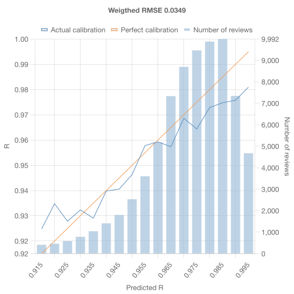
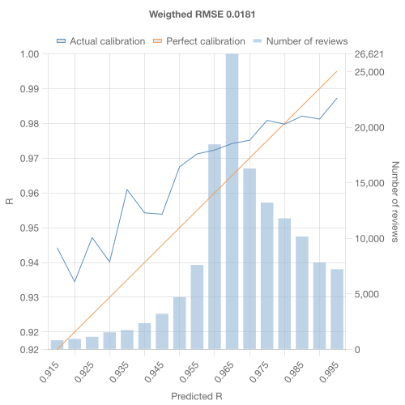
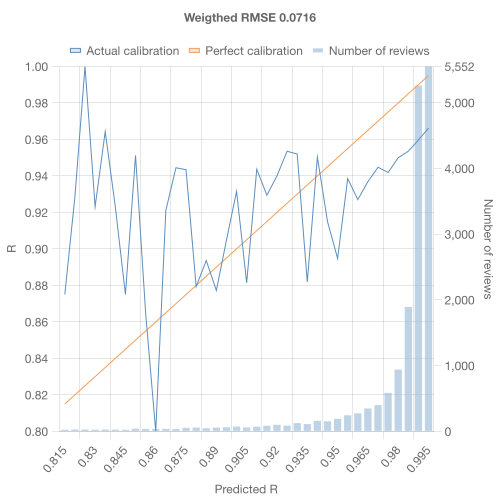

# benchmark

_does it even work?_

## method

the hsrs benchmark is based on the [RMSE(bins)](https://github.com/open-spaced-repetition/fsrs4anki/wiki/The-Metric#rmse-bins) method used by open spaced repetition to evaluate conventional SRSs.

hsrs usage typically involves a mixture of deep and shallow card reviews. this benchmark aims to _only measure the performance of hsrs on deep card recall prediction_. during evaluation all cards have their states updated as normal, but only predictions on deep cards are included in the results so as to isolate the effect of hsrs separate from fsrs.

the benchmark currently doesn't take into account same-day reviews.

## running

- install the hsrs cli `npm i -g @hsrs/cli`
- run `hsrs benchmark <path-to-revlog.json> <path-to-deck.json> <graph-output.png>`

you can download the grsly deck.json [here](https://app.grsly.com/jp.deck.json)

## results

for now there is relatively little data for the benchmark, so results are not necessarily representative. these results are based on a [dataset](https://github.com/satchelspencer/hsrs-bench-data) including mostly my own revlog and a few other willing users so it's little more than a preliminary sanity check.

of the 463k total reviews, only 72k are on deep cards. this is due to users having significant anki histories before using hsrs, as well as reviewing both deep and shallow cards in hsrs. all 463k are updated during evaluation because deep card retention depends on shallow card states and visa versa.

the probability distribution is also _incredibly_ biased due to hsrs' very high target retention for deep cards (so you see them more frequently) and essentially never reviewing late. there's _barely_ any data below r=0.9 and it's very noisy.

although not an apples-to-apples comparison due to the vastly different datasets, it is somewhat strange that the error 0.0349 is lower than in fsrs' own official [benchmark](https://github.com/open-spaced-repetition/srs-benchmark?tab=readme-ov-file#without-same-day-reviews) since i would expect deep cards to be fundamentally more difficult to estimate as their content isn't fixed.

to make sure that this is a reasonable error, lets benchmark vanilla fsrs on _only the shallow cards_ from the same dataset.

indeed the error is _even_ lower at 0.0181, so the underlying data is particularly easy for fsrs compared with the dataset used in the fsrs benchmark.

_so, what if we use vanilla fsrs on the deep cards? i.e discard all the sub-card scheduling information. do we even need hsrs to schedule this type of card?_

as expected, fsrs drastically over-estimates recall on deep cards. this supports the key underlying assumption of hsrs: that the components of a deeply nested card provide valuable scheduling information!

while it's still very early, this benchmark will still be useful for measuring comparative improvements in future versions of hsrs, especially once hsrs supports optimizing its own hyperparameters!
